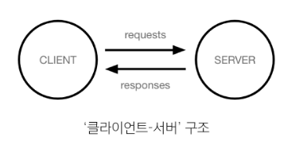
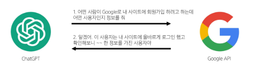

# 1월 17일 API 부분부터
## Interface
- 두 개의 시스템(기기, 소프트웨어 등) 이 정보를 교환할 때 그 사이에 존재하는 접점
- 사용자가 기기를 쉽게 동작 시키거나 기계끼리 통신할 때 필요한 **'약속된 방식'**

### 예시
- 컴퓨터와 사람 사이 물리적 인터페이스 : 키보드, 마우스, 모니터
- Tv와 사람 사이 : tv 리모컨
- 자동차 내부 장치와 운전자 : 운전대 , 페달
- 디지털 인터페이스 : 스마트폰 터치 스크린린

## UI
사용자가 소프트웨어에 접근하는 그래픽적/화면적 요소  
ex) ATM의 언어선택 화면, 뒤로가기 버튼, 아이콘 등등  
실제로 기계끼리, 시스템 끼리 인터페이스를 통해 정보를 주고받음  
화면(UI)가 없을 뿐 약속된 방식으로 데이터 주고받음

# 클라이언트
  
사용자가 브라우저로 특정 주소(URL) 요청 -> 서버가 해당 페이지,데이터를 보내줌

### 클라이언트
서비스를 요청하는 쪽(웹 브라우저, 모바일 앱)

### 서버
요청을 받아 처리하고, 결과를 응답해주는 쪽(웹 서버, DB서버)
  
# API
- Application Programming Interface  
- 두 소프트웨어 또는 시스템이 서로 통신할 수 있게 하는 매커니즘  
- 약속된 방식의 인터페이스로, 일정 규칙에 따라 테이터를 요청하고 응답하는 규칙 제공  
  
--> 프로그램 사이에서 통신을 하게 하는 것

## Aplication
특정 기능을 수행하는 모든 소프트웨어

## API 활용 - GPT, 날씨 앱 등
소셜 로그인: 회사에 맡기는 것(구글), gpt는 구글 회원이니 받아줌
  
- 가운데 부분이 API  
- 이렇게 요청을 보내면 이렇게 정보를 제공 해줄 것이다. 라는 메뉴얼  
- 소프트웨어와 소프트웨 간 지정된 형식으로 소통하는 수단 = API

## API Key
- API에게 요청을 보내는 앱을 구별하기 위한 고유한 식별 문자열  
- saljdgijs처럼 랜덤하게 생선된 키를 서버가 발급
- 필요한 이유
  - 보안 강화 : 무단 접근 차단, 승인된 사용자만 요청 가능하도록
  - 데이터 관리 : API호출 횟수, 사용량 모니터링 / 일정량 사용시 제한or과금
- 주의사항
  - 공개된 곳에 노출 X
  - 키가 유출될 경우 무단 사용 위험 -> 정기 갱신 필요
  - 서버-클라이언트 구조에서 키를 안전하게 저장하는 방법 고려